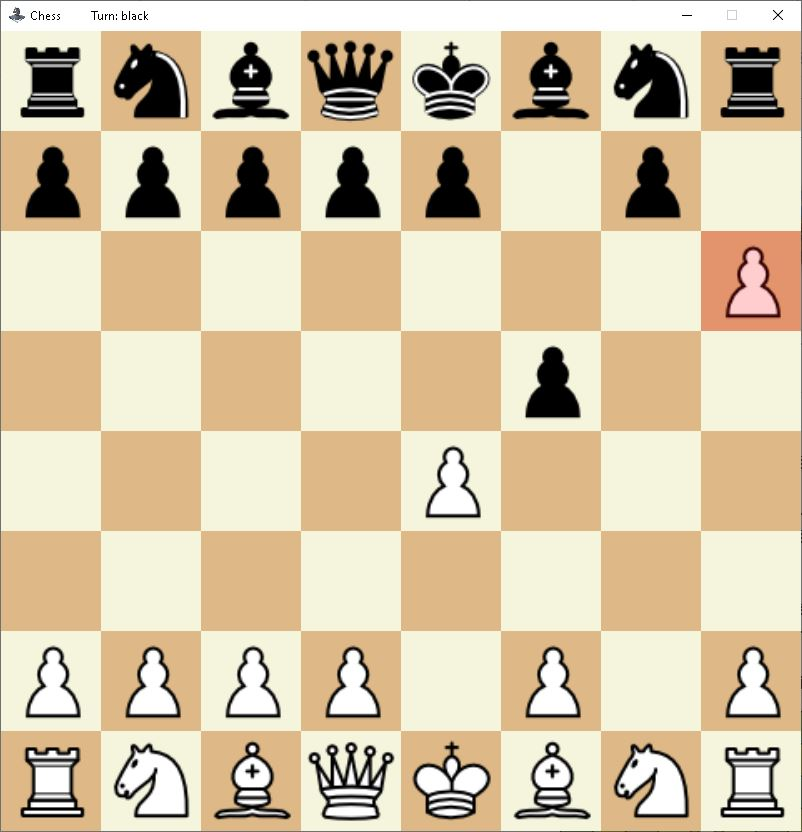

# My Chess Game

Welcome to My Chess Game, a basic implementation of chess created in C# Forms. This project was developed as a part of a high school project to demonstrate fundamental programming skills using C#.

## Features

- Graphical user interface implemented with C# Forms.
- Classic chess gameplay with standard rules.
- Simple yet intuitive user interface for easy gameplay.

## Enhancements:
- AI Opponent: Introducing an AI opponent for engaging single-player mode.
- Multiplayer Across Computers: Enabling multiplayer functionality for inter-computer gameplay across a network.

## Screenshots

### Start Screen

### Victory Screen

### Restart Option

### Available Moves Highlighted

### Before Pawn Promotion

### Promotion Selection

### After Pawn Promotion

### En Passant - 1

### En Passant - 2

## Getting Started

To run the Chess Game on your system, follow these steps:

1. Clone or download the repository to your local machine.
2. Open the solution file in Visual Studio or any compatible C# IDE.
3. Build the solution to ensure all dependencies are resolved.
4. Start the application from the IDE or by running the executable file.

## License

Copyright © 2024 Cosmin Timis

Licensed under the MIT License. See [LICENSE](LICENSE) for details.